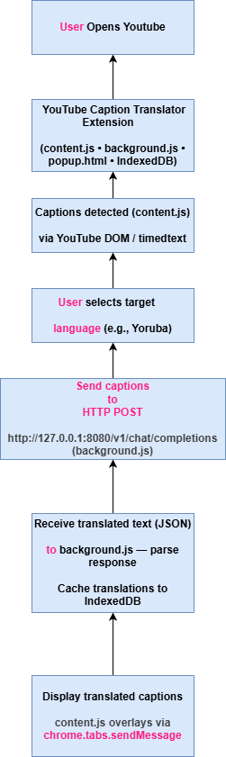

---

# 🎬 YouTube Caption Translator (Local N-ATLaS)

The **YouTube Caption Translator** is a Chrome extension that automatically translates YouTube video captions into a user’s **native language** using a local language model (N-ATLaS / llama-server) running on the user's machine. No external cloud API calls are required — all translation happens locally.

---

## 🚀 Features

-   🧩 Detects captions from any YouTube video
-   🌐 Translates captions using a local N-ATLaS model (llama-server)
-   💬 Displays translated text as live overlay on YouTube videos
-   ⚙️ Simple browser extension setup
-   🎨 Clean UI via popup and toolbar integration

---

## 🧭 System Flow

The high-level process flow is illustrated below:

1.  User opens YouTube
2.  The **YouTube Caption Translator** extension activates
3.  Captions are detected via YouTube’s DOM or API
4.  User selects target language (e.g., Yoruba, Hausa, Igbo, Swahili, etc.)
5.  Captions are sent to your local N-ATLaS (llama-server) instance running on `http://127.0.0.1:8080`
6.  Translated text is received from the local model and rendered as subtitles
7.  Translated captions appear in real-time on the video

## 📊 Flowchart

The high-level flowchart (user-facing flow) is shown below:


**Architecture**

The diagram below shows the extension architecture and how it communicates with a locally hosted LLaMA/llama-server instance running on your machine.



---

## 🧱 Project Structure

```text
youtube-caption-translator/├── flowchart-architecture.drawio  # Editable architecture diagram (draw.io)
├── assets/│   └── flowchart-architecture.png        # Exported visual version├── manifest.json            # Chrome extension manifest (v3)├── background.js            # Handles background events and API logic├── content.js               # Injected into YouTube pages├── popup/│   ├── popup.html           # Extension popup interface│   ├── popup.js             # Popup functionality and event handling│   └── popup.css            # Styling for popup interface└── scripts/    ├── translator.js        # Handles NTAtlas API translation requests    └── captions.js          # Extracts and synchronizes YouTube captions
```

---

## 🧩 Technologies Used

-   **JavaScript (ES6+)**
-   **Chrome Extension API (Manifest V3)**
-   **Local language model (llama-server / N-ATLaS) accessed over localhost**
-   **HTML5 / CSS3**
-   **IndexedDB for caching translations**
-   **Draw.io (System Flow Diagram)**
-   **VS Code**

---

## ⚙️ Setup Instructions (Local model)

1.  Clone this repository:

```bash
git clone https://github.com/Cryptim/Youtube-Nigerian-caption-translator.git
```

2.  Start your local N-ATLaS / llama-server instance on the machine. The extension expects the server to be reachable at `http://127.0.0.1:8080` (or `http://localhost:8080`). How you start the server depends on your local model setup — for example, run your llama-server command or use the provided instructions for N-ATLaS.
    
3.  Open in VS Code (optional):
    

```bash
code Youtube-Nigerian-caption-translator-main
```

4.  Load the extension in Chrome:

```text
Open chrome://extensions/Enable Developer ModeClick 'Load unpacked' and select this project folder
```

5.  Open a YouTube video with captions enabled. The extension will inject `content.js`, prefetch captions, and translate them via your local model. Prefetching and caching are automatic; use the popup to change language or clear overlays.

---

## 🔗 Local model (N-ATLaS / llama-server)

This project uses a locally hosted model instance (N-ATLaS or a compatible llama-server). No cloud API key is required. The extension sends translation requests to the local server's OpenAI-compatible endpoint `/v1/chat/completions` on your machine (localhost — not the cloud).

If you need help starting a local llama-server, follow the step-by-step instructions below (Windows example). These steps show how to install a llama-server, place the GGUF model, start the server, and test the local server's OpenAI-compatible endpoint (this is a local endpoint, not OpenAI's cloud API).

### Local setup (Windows example)

1.  Install a llama.cpp / llama-server build (example using `winget`):

```powershell
winget install llama.cpp
```

2.  Download the N-ATLaS GGUF model and save it in a folder called `llama` on your Desktop. Example filename:

```
N-ATLaS-GGUF-Q8_0.gguf
```

3.  Open a Command Prompt in the `llama` folder (where you saved the model) and confirm the file is present:

```powershell
cd %UserProfile%Desktopllamadir
```

You should see:

```
N-ATLaS-GGUF-Q8_0.gguf
```

4.  Start the model server (run inside the model folder):

```powershell
llama-server -m N-ATLaS-GGUF-Q8_0.gguf --port 8080
```

What this does:

-   Starts the AI model locally
-   Runs the server on port `8080`
-   Exposes an OpenAI-compatible local endpoint at `http://localhost:8080` (local only — not OpenAI cloud)

5.  Verify the server is working (open a new Command Prompt and run):

```powershell
curl http://127.0.0.1:8080/v1/chat/completions ^    -H "Content-Type: application/json" ^    -d "{"model": "local", "messages": [{"role": "user", "content": "Hello"}]}"
```

You should see a response similar to:

```json
{    "choices": [{        "message": { "content": "Hello! How can I assist you?" }    }]}
```

6.  Alternatively, start the server by specifying the full path to the model file:

```powershell
llama-server -m "C:pathtoN-ATLaS-GGUF-Q8_0.gguf" --port 8080
```

Quick start (PowerShell)

If you prefer a small helper script, a Windows PowerShell starter is included at `scripts/start-llama.ps1`. Edit the `ModelPath` inside the script or pass `-ModelPath` when running to point to your GGUF file, then run:

```powershell
.\scripts\start-llama.ps1
```

This will launch a `llama-server` process pointing at the model and port `8080` (adjustable).

If you'd like I can add macOS / Linux examples or a short troubleshooting checklist.

---

## 🧑‍💻 Contributors

-   **Timothy Ignatius Agbor** — Developer
-   **Awarri AI Team** — Language model provider

---

## 📜 License

This project is licensed under the [MIT License](LICENSE).

---

### ✅ Notes

-   The extension is designed to operate with a local model server; if you later want cloud support we can add an optional adapter.
-   IndexedDB is used to cache translations so playback is fast after prefetch.
-   If a video's timedtext is unavailable the extension falls back to DOM caption extraction.

---